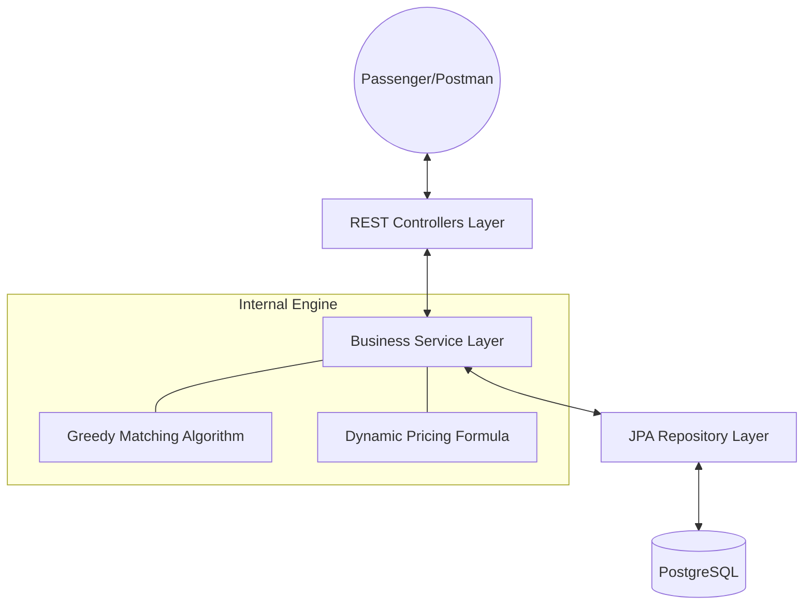
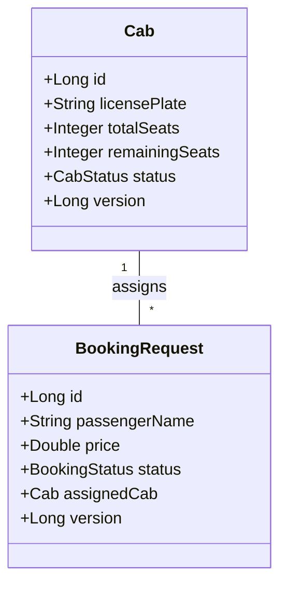

# Smart Airport Ride Pooling Backend System 🚗✈️


A robust, high-performance Spring Boot backend designed to manage and group airport cab requests efficiently. This system optimizes vehicle utility through a greedy matching algorithm, handles high concurrency with optimistic locking, and provides a transparent dynamic pricing model in INR.

## 1. Overview
The system allows passengers to book rides from the airport, specifying their destination and luggage requirements. The backend dynamically matches these requests with available or partially filled cabs based on geographic proximity (Haversine distance) to minimize passenger wait times and maximize cab occupancy.

## 2. Tech Stack
*   **Framework:** Spring Boot 3.2.2 (Java 17)
*   **Database:** PostgreSQL (with indexing for performance)
*   **ORM:** Spring Data JPA / Hibernate
*   **Documentation:** Swagger UI / OpenAPI 3.0
*   **Containerization:** Docker & Docker Compose
*   **Utility:** Lombok (Boilerplate reduction), Dotenv (Environment management)

## 3. System Architecture (HLA)
The system follows a standard **N-Tier Architecture** ensuring separation of concerns:



## 4. Low Level Design (LLD)
The system utilizes key design patterns:
*   **DTO Pattern:** Separates internal entities from API responses/requests.
*   **Mapper Pattern:** Centralized logic to convert between Entities and DTOs.
*   **Singleton/Service Pattern:** Core business logic encapsulated in `@Service` beans.
*   **Repository Pattern:** Abstracts database operations into clean interfaces.



## 5. Database Schema & Indexing Strategy
The database is optimized for heavy search operations:
*   **`idx_cab_status`**: Speeds up finding available cabs for the matching engine.
*   **`idx_booking_status`**: Quickly filters for pending passenger requests.
*   **`idx_booking_destination`**: A composite index on `(dest_lat, dest_lng)` to optimize spatial proximity searches during pooling.

## 6. API Documentation
The API is fully documented via **Swagger**. Once the application is running, you can access the interactive UI at:
👉 [http://localhost:8081/swagger-ui/index.html](http://localhost:8081/swagger-ui/index.html)

### Swagger Screenshots
| Feature: Cab & Booking | Feature: Operations & Status |
| :--- | :--- |
| **Register a Cab**<br> | **Register Pooling**<br> |
| **Passenger Booking**<br> | **Check Status**<br> |
| **Cancel Booking**<br> | **Pending Bookings**<br> |

## 7. Setup & Run Instructions
1.  **Clone the Repository**:
    ```bash
    git clone <repository-url>
    cd RidePoolingSystem
    ```
2.  **Environment Variables**: Create a `.env` file based on `.env.example`.
3.  **Start Database**:
    ```bash
    docker-compose up -d
    ```
4.  **Run Application**:
    ```bash
    ./mvnw spring-boot:run
    ```

## 8. Concurrency Handling Strategy
The system uses **Optimistic Locking** via the `@Version` annotation to handle 10,000+ concurrent users safely. 
*   **Problem**: Two threads might try to assign the last seat of a cab to two different passengers simultaneously.
*   **Solution**: Hibernate checks the `version` column before updating. If another thread changed the record first, the transaction fails and rolls back, preventing "Double Booking".

## 9. DSA Approach & Complexity
We use a **Greedy Matching Algorithm**:
1.  Fetch all `PENDING` bookings.
2.  For each booking, find the first available `Cab` that matches seat/luggage requirements.
3.  **Refinement**: If the cab is already partially filled, we only pool if the new passenger's destination is within **10km** (Haversine Distance) of the existing passenger to avoid excessive detours.
*   **Complexity**: $O(B \times C)$, where $B$ is the number of pending bookings and $C$ is the number of available cabs.

## 10. Dynamic Pricing Strategy
Fares are calculated using the following logic:
*   **Base Fare**: Rs150.00 (Standard pickup fee).
*   **Distance Rate**: Rs18.00 per Kilometer.
*   **Pooling Incentive**: Passengers get a **20% Discount** if they share the cab with someone else.
*   **Formula**: `Final Fare = (Base + Distance * Rate) * (isPooled ? 0.8 : 1.0)`

## 11. Assumptions
*   Pickup always starts from the Airport (Point A).
*   Coordinates provided are within a valid geographic range (Decimal Degrees).
*   Cab capacity includes the driver (Driver seat is not counted in totalSeats).

## 12. Sample Test Data
You can directly copy these JSON payloads into Postman or Swagger UI to test the system flow.

### STEP 1: Register a Cab
**Endpoint:** `POST /api/cabs`
```json
{
  "licensePlate": "DL01-AB-1234",
  "model": "Toyota Innova",
  "totalSeats": 6,
  "maxLuggage": 4
}
```

### STEP 2: Create a Ride Request
**Endpoint:** `POST /api/bookings`
```json
{
  "passengerName": "Rohit Sharma",
  "pickupLat": 28.5562,
  "pickupLng": 77.1000,
  "destLat": 28.4595,
  "destLng": 77.0266,
  "seatsRequired": 1,
  "luggageQuantity": 1
}
```

### STEP 3: Run the Matching Engine
**Endpoint:** `POST /api/pooling/run` (No body required)

### STEP 4: Check Final Price & Assigned Cab
**Endpoint:** `GET /api/bookings/{id}`
*(Use the ID returned from Step 2)*

### STEP 5: Cancel a Booking
**Endpoint:** `DELETE /api/bookings/{id}/cancel`

## 13. Performance Considerations
*   **Indexing**: Critical columns are indexed to maintain sub-second response times.
*   **Connection Pooling**: Uses **HikariCP** for efficient database connection management.
*   **Transactional Integrity**: All critical operations are `@Transactional` to prevent data corruption during failures.

---

*Built to showcase scalable system design, robust concurrency control, and efficient real-world ride pooling optimization.*


